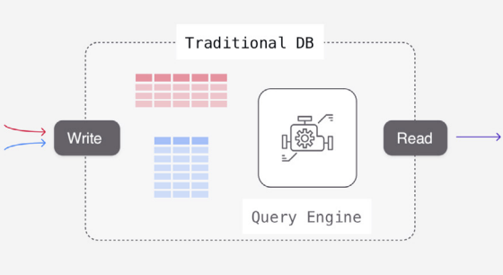
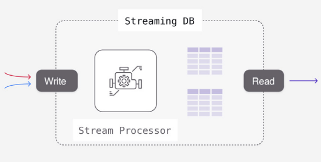
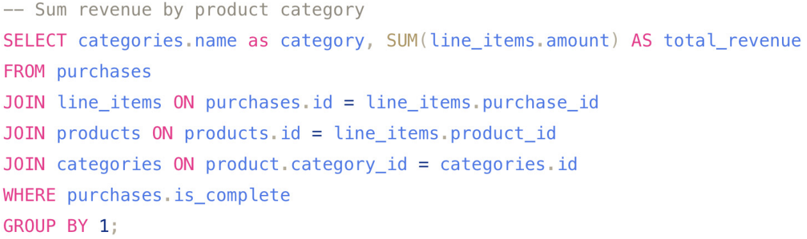
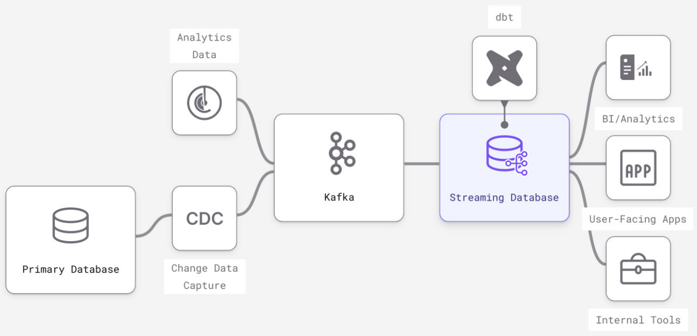

### Introduction
Streaming databases provide fast continuous data transformation capabilities not possible in traditional databases. They use SQL and the familiar RDBMS abstractions, viz. tables, columns, rows, views, indexes, for streaming data. However, they have a completely different engine (a stream processor) and computing model (dataflows) inside.

For the same kinds of complex SQL joins, aggregations, and transformations *Streaming Databases* serve results with sub-second latency, while `Transactional Databases` don’t scale and take hours to run in analytical databases.

In traditional DBs, data is stored in tables matching the structure of the inserts & updates and all the computation work happens on read queries.



A streaming database moves the work to the write side: Instead of just storing data on writes, a streaming database asks for the queries upfront in the form of Materialized Views and incrementally updates results as input data arrives.



### Origins
In the capital markets vertical, where the value of fast computation over continuous data is highest. StreamBase and KX System were the early flavours of streaming databases. However, these were more "event processing frameworks" than databases. These early generation of "streaming databases" optimised for unique requirements of hedge funds and trading desks and not universality and accessibility.

Early streaming DB tools implemented SQL-like control languages. In StreamBase, resources were created with DDL statements like ```CREATE INPUT STREAM```. But the SQL was just surface level, users still needed to be streaming systems experts first and foremost.

SQL below doesn’t care if the data is static or actively updating. It has the info a streaming database needs to continually provide updated result sets as the soon as the data changes.


Tools like ksqlDB and Flink took the SQL control layer implementation further, allowing users to define transformations in SQL. However, users coming from traditional databases still had a lot of challenging streaming concepts to work around, like eventual consistency.

Modern streaming databases (like Materialize, Vectorized, etc.) focus on expanding access to (and therefore applications of) streaming computation by simplifying the control interface to the extent that it can be operated by anyone familiar with traditional databases.

### Example Architectures
Modern streaming databases are often used “downstream” of primary transactional databases and message brokers, similar to how a Redis cache or a data warehouse might be used.



* A message broker like Kafka is used to reliably and continuously feed streams of data into the database.
* A Change Data Capture (CDC) service translates primary DB updates into structured data messages in Kafka.
* Like in data warehouses, the SQL transformations are managed in dbt.
* Downstream architecture is more flexible than data warehouses, user-facing applications and internal tools can connect directly to the streaming database without the need for caching.

## Use cases for Streaming Databases
* **Real-Time Analytics:** using ANSI SQL build real-time views to serve internal and customer-facing dashboards, APIs and apps.
* **Automation and Alerting:** Build user-facing notifications, fraud and risk models, and automated services using eventdriven SQL primitives in a streaming database.
* **Segmentation and Personalization:** engaging experiences with customer data aggregations that are always up-to-date: personalization, recommendations, dynamic pricing and more.
* **Machine Learning in Production:** Power online feature stores with continually updated data, monitor and react to changes in ML effectiveness - all in standard SQL.

## Features / Advantages
* Incrementally updated materialized views on arbitrarily complex SQL/s
* True streaming inputs
* Streaming outputs on queries
* Subscribe to changes in a query

## Missing Features / Disadvantages
* Columnar optimization
* Non-deterministic SQL functions: like RANDOM() are common and straightforward in traditional databases, but running a non-deterministic function continuously results in chaotic noise

## Performance and Scalability
* Data arrival (input) to change reflecting in the streaming database is sub-second and because of incremental updates updates do not slow down as the dataset scales
* When a query or query pattern is known and pre-computed as a persistent transformation, reads are fast because they require no computation: You’re just doing key-value lookups in memory, similar to a cache like Redis.
* Resources requirement to handle persistent transformations $$\propto$$ number of rows in the output (and not the scale of the input)
* This can lead to dramatic improvements in performance in aggregations in a streaming DB vs a traditional DB
* Ad-Hoc Query Response Times are compromised because the computation plan is optimized for continuously maintaining results, not answering point-in-time results.
* A window function performs a calculation across a set of table rows that are somehow related to the current row. They are less performant in streaming databases because an update to a single input row can necessitate updates to every output row. For example, consider a RANK() window function that ranks output by a computation. A single update (resulting in a new #1 ranked item) can force an update to every row in the output.
* updates to input data is what triggers work in the system, so data that is changing often will require more CPU than data that changes rarely
* Cardinality of dataset: The total number of unique keys will slow down read queries in traditional databases. In streaming databases, high-cardinality increases the initial “cold-start” time when a persistent SQL transformation is first created, and requires more memory on an ongoing basis.
* Complexity of transformations: Unlike the on-request model in a traditional DB, SQL transformations are always running in a streaming database. This has an impact on scale in two ways: 
	* Memory required to maintain intermediate state: Imagine how you would incrementally maintain a join between two datasets: You never know what new keys will appear on each side, so you have to keep the entirety of each dataset around in memory. This means that joins over large datasets can take a significant amount of memory. 
	* Quantity and complexity of transformations. When a single change in inputs needs to trigger a change in outputs in many views, or when there are many layers of views that depend on each other, more CPU is needed for each update.
* Frequency of reads from (arbitrarily complex) materialized views - Complex queries that include joins and aggregations are handled as persisted computation, so high volumes of reads, spikes, and high concurrency have minimal impact on streaming databases.

# References:
[What is a streaming database](https://content.dataversity.net/rs/656-WMW-918/images/Materialize-Q32023-What-is-a-Streaming-Database.pdf)
